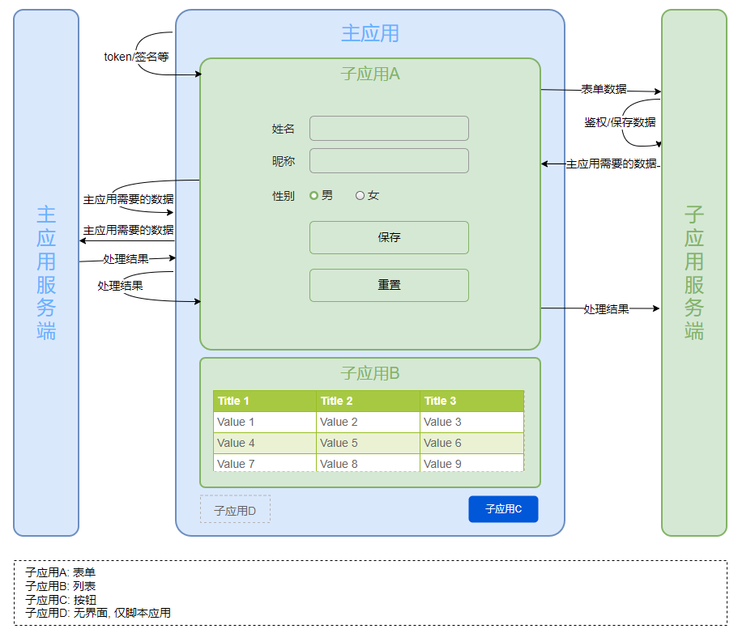

# micro-app-helper

[micro app](https://micro-zoe.github.io/micro-app/) 的工具函数. 目前包含事件的监听执行, 数据(方法)的注册.

因为通过 `Promise` 完成事件的通信, 所以一个事件只支持一个监听函数, 多次监听会丢弃或覆盖(`force = true`)旧的监听事件.

## 安装

```bash
yarn add micro-app-helper
# or npm
# npm install micro-app-helper
```

## 使用

### 主应用

```typescript
// src/main.ts

import microApp from '@micro-zoe/micro-app'
import { setupMicroApp } from 'micro-app-helper'

setupMicroApp(microApp, {
  mount: () => { /** do somthing... */ },
  unmount: () => { /** do somthing... */ },
})
```

```typescript
// example-main.vue

import microApp from '@micro-zoe/micro-app'
import { useMicroApp } from 'micro-app-helper'

const app1 = useMicroApp(microApp, 'app1')

// 触发子应用方法
const result = await app.dispatch('submit', formData.value)
console.log(result?.data)
result?.resolve()

// 主应用方法注册到子应用
app1.register({
  hello() { console.log('world') },
  foo: 'bar', // 不会监听变化
})

// 监听子应用方法
app1.addEventListener('tada', handleTada)
```

### 子应用

```typescript
// example-sub-app1.vue

import { useMicroApp } from 'micro-app-helper'

const subApp = useMicroApp({
  onRegistered(data) {
    console.log(data)
    // { hello: fn, foo: 'bar' }
  },
})

// 触发主应用 tada
subApp.dispatch('tada', '🎊🎊🎊🎊🎊')

// 监听主应用 submit
subApp.addEventListener('submit', handleSubmit)
```


